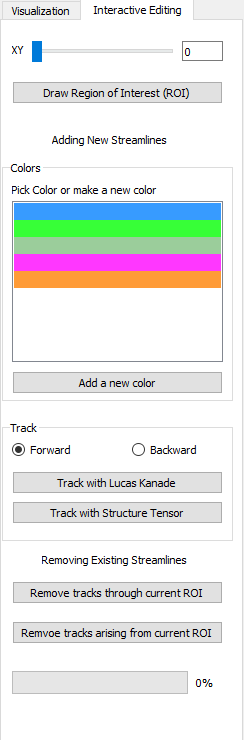

# NerveTracker
Software to track fibers in block-face microscopy images.

The software provides the user with the following options
1. Load a 3D-MUSE image dataset (as a set of 2D PNG files)
2. Visualize the stack by moving across slices
3. Run one of two available flow estimation methods (optic flow and structure tensor analysis)
4. Cluster generated tractograms containing several streamlines
5. Interactive editing of tractograms
6. Save tractograms to disk for loading in the future.

Tractogram based metrics
Tool for comparing two tractograms based on a closest neighbor distance metric is available from the GUI.
Tool for computing Dice overlap between the tractogram and a binary mask is available from the script validate_tractograms.py

## Installation

1. Clone this repository
```git clone https://github.com/ckolluru/NerveTracker.git```

2. Navigate to the repository folder

3. Create a conda environment
```conda create --name tracking --file requirements.txt```

4. Activate the environment
```conda activate tracking```

## Algorithms
Along with the image stack, a binary mask is provided at an arbitrary slice. 
<br />This mask indicates the regions of interest from which seed points will be sampled for tracking.
<br />Tracking can be done in either directions along the stack (forward and backward).
<br />Seeds per pixel indicates the number of seed points that will be created (default 1 per 100, or 0.01). 

<br />There are two options to run the tractography analysis, optic flow and structure tensor analysis.
<br />Parameters to both algorithms can be set by the user and default values are provided. 

<br />The optic flow analysis uses the Lucas-Kanade algorithm, the specific implementation is from the opencv2 library. 
<br />Please refer to the [library’s documentation](https://docs.opencv.org/3.4/d4/dee/tutorial_optical_flow.html) for a description of the parameters. 
<br />More information about the Lucas-Kanade algorithm are available in a set of [introductory videos online](https://www.youtube.com/watch?v=lnXFcmLB7sM&list=PL2zRqk16wsdoYzrWStffqBAoUY8XdvatV&index=1) (videos 1-6).

The software can also analyze the dataset using the structure tensor approach. 
<br />The images are down sampled in XY by a suitable integer factor to create near-isotropic voxels in XYZ.
<br />An introduction to the structure tensor approach is available [here](http://people.compute.dtu.dk/vand/notes/ST_intro.pdf). 

<br />Clustering threshold is a metric that is used by the [Quickbundles algorithm](https://doi.org/10.3389%2Ffnins.2012.00175) to cluster streamlines to generate a compact representation and visualization of the tractogram. 

## App Demo
1.	Open a terminal and activate the conda environment. Run python main.py to run the program with or without debugging/breakpoints.
<p align="center">
  
</p>

2.	There is some sample data in the sample_data subfolder of the repo that we will use.

3.	Open File > Open Image Folder. Select the sample_data folder.

4.	File > Mask Image for Seeds. Select the image inside the Mask Image sub folder in sample_data.

5.	File > Enter Image Metadata \ XML. Add the following values.
<p align="center">
  
</p>

6.	Now, we are ready to visualize the data. In point of view, select XY and Axes. Check slice display on XY and scroll in the 3D window on the right. You should see the first slice of the data and bounding box. Play around with the slice number scrollbar and opacity scrollbar in the slice display window.


7.	Leave the default parameters for tractography Lucas Kanade as is, leave seeds per pixel text box to 0.01, and click on the compute tracks LK button. It will take about a minute to compute. Click on the streamlines checkbox to visualize the streamlines.


8. The 3D window should look similar to the one shown here.


9. Colors can be selected from the colors ist drop down, and the Select tracks by Color option can be selected to selectively visualize streamline groups. 


10. The clip option allows the user to show streamlines for a select number of slices above the currently displayed 2D XY slice. This number of slices during the clip option can be controlled with the slider provided below. Streamline opacity can be modified using a slider.

11. Anatomically constrain streamlines button can be clicked to ensure that the tracts generated lie within fascicle regions. First, a stack containing fascicle segmentations should be provided using the File menu, Open Fascicle Segmentations folder option. 

## Interactive Editing
Interactive editing options are available to edit streamlines by the users. 



Users can scroll to a specific slice. 
In this window, the 3D visualization will default to parallel perspective for ensuring that the zoom factor is constant across all slices. 

The user can then select the draw region of interest (ROI) button and then start clicking on the image. A contour should be drawn which will be displayed in a red outline. If a new set of tracks need to be generated from this contour (ROI), a color can be selected. The list of current colors in the tracks are shown. If a new color needs to be created, a button is provided. Tracks can be added either using the structure tensor or Lucas Kanade approaches. 

If tracks need to be deleted, two options are available. Either all tracks passing through this ROI can be deleted or only the portions of tracks originating from the ROI can be deleted.
